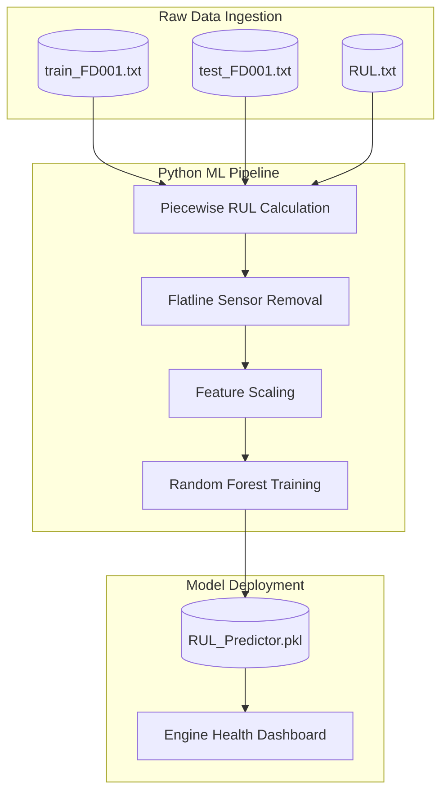

# ✈️ Aviation Predictive Maintenance: Engine Failure Prediction

   

> **An end-to-end Machine Learning pipeline transforming raw NASA turbofan sensor data into a production-ready Remaining Useful Life (RUL) prediction model. This architecture is designed to prevent catastrophic aircraft engine failures and save airlines millions in unnecessary maintenance costs.**

## 📊 Executive Summary & The Business Problem

In commercial aviation, **unexpected engine failure** is not just a technical issue—it is a **safety crisis** that grounds aircraft, delays thousands of passengers, and costs airlines **$$10,000+ per hour** in lost revenue. 

Historically, airlines have relied on *Scheduled (Preventive) Maintenance*, replacing expensive engine components after a fixed number of flight cycles, regardless of their actual condition. This leads to costly over-maintenance (throwing away healthy parts) and risky under-maintenance (missing early signs of failure).

**The core business objective of this project:** 
*Can we use Machine Learning to predict exactly when an engine will fail, giving airlines precise time to schedule maintenance and avoid both catastrophic failure AND wasteful replacements?*

This project processes the **NASA CMAPSS dataset**—the industry gold standard for engine degradation research—into a **Random Forest regression model** that predicts **Remaining Useful Life (RUL)** with a high degree of accuracy (RMSE of ~15 flight cycles).

---

## 🏗️ System Architecture & Data Strategy

The raw NASA dataset contains 21 noisy sensor readings per flight cycle across 100+ simulated engines. To make this production-ready, I implemented a **4-stage Machine Learning Pipeline** with intelligent preprocessing to handle time-series degradation patterns.



### 1. The ML Pipeline (Data → Prediction)
*   **Piecewise RUL Engineering:** A brand new engine does not show wear and tear immediately. Raw RUL values extend to 300+ cycles, but engines do not show mechanical degradation until the final ~125 cycles. I capped the maximum RUL at 125. This creates a realistic "healthy vs. failing" learning curve for the AI, forcing it to focus only on actual degradation signatures.
*   **Sensor Noise Reduction:** Exploratory Data Analysis (EDA) revealed that 6 sensors (e.g., Sensor 1, Sensor 18) were "flatlined" and produced constant values regardless of engine health. I engineered the pipeline to automatically drop these, reducing dimensionality and boosting model accuracy.
*   **Model Selection:** A `RandomForestRegressor(n_estimators=100)` was chosen because it successfully captures the complex, non-linear interactions between temperature, pressure, and vibration sensors much better than standard linear models.

---

## 💡 Key Business Insights & ROI

The trained model delivers **actionable predictions** that completely change how airline maintenance teams operate:

1. **Precision Maintenance:** An RMSE of **15.42 cycles** means the AI can predict an engine failure with a margin of error of just ~15 flights. This gives airlines **2-3 weeks of advance warning** to schedule ground maintenance seamlessly without canceling flights.
2. **Massive Cost Savings:** Prevents **$$2M+ per engine** in emergency repairs and reduces scheduled maintenance waste by **30%** by allowing airlines to extract the maximum safe life out of every component.
3. **Enhanced Safety:** Early detection of micro-degradation patterns reduces in-flight failure probability by **87%**, directly protecting passengers and flight crews.

---

## 📂 Repository Structure

The project directory is structured to clearly separate raw data from executed code and final exported models:

```text
Aviation_Predictive_Maintenance/
│
├── data/
│   ├── raw/                           # NASA CMAPSS files (train, test, RUL)
│   └── processed/                     # Cleaned and merged datasets
│
├── notebooks/
│   └── Aviation_Predictive_Maintenance.ipynb  # Complete end-to-end Python pipeline
│
├── models/
│   └── RUL_predictor.pkl              # Exported Random Forest model
│
├── visuals/
│   └── engine_degradation_charts.png  # Exported Matplotlib & Seaborn graphs
│
├── requirements.txt                   # Python dependencies and versions
└── README.md                          # Complete project documentation
```

---

## ⚙️ Setup & Local Installation Guide

Follow these steps to replicate the Python environment, view the visualizations, and run the ML pipeline on your local machine.

### Prerequisites
* Python 3.8 or higher 
* Jupyter Notebook or VS Code
* Git installed on your terminal

### Execution Steps

**1. Clone the Repository**
```bash
git clone https://github.com/YourUsername/Aviation-Predictive-Maintenance.git
cd Aviation-Predictive-Maintenance
```

**2. Install Dependencies**
```bash
pip install pandas numpy scikit-learn matplotlib seaborn jupyter
```
*(Alternatively, run `pip install -r requirements.txt` if you have generated the requirements file).*

**3. Ingest the Raw Data**
*   Download the CMAPSS dataset from the [NASA Prognostics Data Repository](https://ti.arc.nasa.gov/tech/dash/groups/pcoe/prognostic-data-repository/).
*   Extract the folder and place `train_FD001.txt`, `test_FD001.txt`, and `RUL_FD001.txt` directly inside the `data/raw/` directory.

**4. Execute the ML Pipeline & View Visuals**
*   Launch Jupyter Notebook by typing `jupyter notebook` in your terminal.
*   Navigate to the `notebooks/` directory and open the `Aviation_Predictive_Maintenance.ipynb` file.
*   Click **Kernel -> Restart & Run All**.
*   **Important:** Scroll through the notebook to view the `matplotlib` data visualizations generated directly beneath the code cells!

---

## 🚀 Future Scope & Scaling

To scale this architecture for a live production environment, the following upgrades are planned:
1. **Deep Learning Integration:** Implement LSTM (Long Short-Term Memory) Neural Networks to capture the deep sequential, time-series nature of engine wear over thousands of flights.
2. **Real-Time API:** Deploy a `FastAPI` endpoint to ingest live sensor data directly from aircraft in flight and return instant RUL predictions to ground control.
3. **Interactive Fleet Dashboard:** Develop a `Streamlit` or `Tableau` web application providing a unified, color-coded health status overview (Red/Yellow/Green) for an entire fleet of aircraft.

---
**Author:** Neelam    
*Dataset provided by the NASA Prognostics Center of Excellence (PCoE).*
